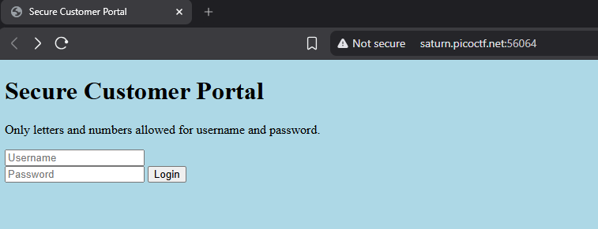
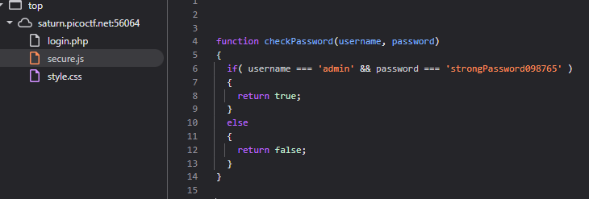
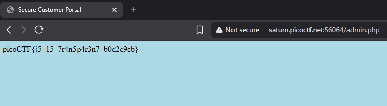

# Local Authority

Category: Web Exploitation  
Difficulty: Easy  

---

Opened the login page and saw a simple username and password form.

I tried a wrong username and password combination and then later checked the page source and noticed a JavaScript file being used for authentication logic.

Inside `secure.js`, the credentials were being checked on the client side.

It was basically comparing:
- username ==  admin  
- password ==  strongPassword098765  

So instead of any real server-side validation, the login was just handled in the browser.

I used those values and logged in successfully.

